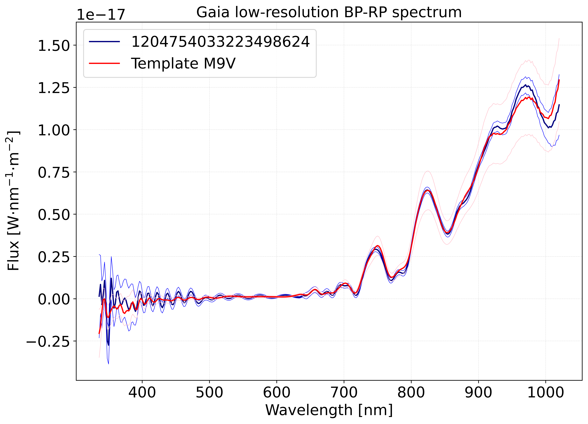

# Gaia_spec

[](http://www.astropy.org/)

This module uses [GaiaXPy](https://gaia-dpci.github.io/GaiaXPy-website), the Gaia BP/RP spectra package. [](https://doi.org/10.5281/zenodo.7566303)

 ```Spec_compare``` is a Python module to compare Gaia low-resolution BP-RP spectra to templates created from Gaia spectra of confirmed spectral types (A0V-L1V).

Usage example:
```
from Spec_compare import compare_spectra

sources = [58925512487888896, 378026395579692672, 200296663143599104, 1204754033223498624]  # K5, M0, M5, M9

results = compare_spectra(sources, plot_spectrum=True, plot_template=True, spectrum_uncertainty=True, template_uncertainty=True)

for result in results:
    print('Gaia source id:', result[0], 'Matched tempalte:', result[2])
```

Console output:
```
Gaia source id: 58925512487888896 Matched tempalte: K5V
Gaia source id: 378026395579692672 Matched tempalte: M0V
Gaia source id: 200296663143599104 Matched tempalte: M5V
Gaia source id: 1204754033223498624 Matched tempalte: M9V
```

Plots:




Docstring:
```
Compares Gaia spectra to templates

Parameters
----------
sources : list
    A list of Gaia source identifiers to download spectra for.
    At least one is required e.g. [1657463068195202432]
plot_spectrum : bool, optional
    Whether to plot the downloaded Gaia spectra. The default is True.
plot_template : bool, optional
    Whether to overplot the matched templates. The default is True.
spectrum_uncertainty : bool, optional
    Whether to plot the spectra uncertainty. The default is False.
template_uncertainty : bool, optional
    Whether to plot the templates uncertainty. The default is False.
output_dir : str, optional
    The directory where the plots will be saved to. The default is tempfile.gettempdir().
file_format : str, optional
    Output file format: pdf, png, eps, etc.. The default is 'pdf'.

Returns
-------
A list containing one row per source including the Gaia source id, the Gaia spectrum, the matched spectral type and the matched template.
All spectra and tempaltes are instances of specutils.Spectrum1D.
Wavelength, flux and error arrays can be extracted as follows:
- Spectrum1D.spectral_axis.value
- Spectrum1D.flux.value
- Spectrum1D.uncertainty.array
```